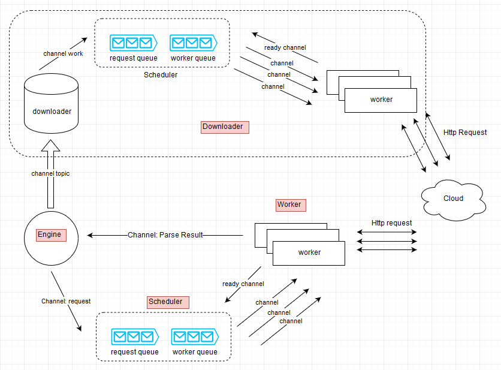

# Image spider

A image spider implemented using Golang

## usage

put a `config.json` file in current folder

default config is as below

```json
{
  "image": {
    "path": "d:\\t66yImage",
    "workerCount": 20,
    "isUniqFolder": true
  },
  "engine": {
    "workerCount": 2,
    "elasticUrl": "http://172.16.3.116:9200"
  },
  "init": {
    "topicPerPage": 100,
    "startPageNum": 20,
    "endPageNum": 100,
    "seeds": [
      //亚洲无码原创
      // "http://t66y.com/thread0806.php?fid=2",
      // //亚洲有码原创
      // "http://t66y.com/thread0806.php?fid=15",
      // // 欧美原创
      // "http://t66y.com/thread0806.php?fid=4",
      //动漫原创区
      // "http://t66y.com/thread0806.php?fid=5"
      // // 国产原创区
      // "http://t66y.com/thread0806.php?fid=25",
      // //中字原创
      // "http://t66y.com/thread0806.php?fid=26",
      // // 转贴交流
      // "http://t66y.com/thread0806.php?fid=27",
      // // 新时代
      "http://t66y.com/thread0806.php?fid=8"
      // //达盖尔
      // "http://t66y.com/thread0806.php?fid=16",
      // http下载
      // "http://t66y.com/thread0806.php?fid=21"
    ]
  },
  "nameLenLimit": 60,
  "net": {
    "timeOut": 30,
    "proxyUrl": "socks5://localhost:1080"
  }
}
```

## Downloaod image and save elastic search

```sh
go get github.com/wuxiangzhou2010/imagespider
cd $GOPATH/src/github.com/wuxiangzhou2010/imagespider
go run github.com/wuxiangzhou2010/imagespider
```

## Web search page

```sh
cd $GOPATH/src/github.com/wuxiangzhou2010/imagespider
go run github.com/wuxiangzhou2010/imagespider/frontend
```

## arch


